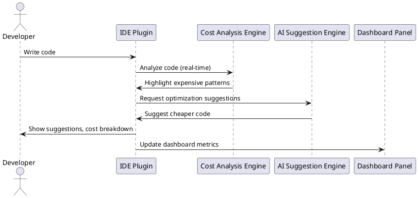

# FinOps AI - Real-Time Code Cost Analyzer

## Design Document

### 1. Architecture Overview
- **IDE Plugins:**
  - VSCode (MVP), IntelliJ (future), PyCharm, WebStorm
- **Core Engine:**
  - Real-time code analysis, cost calculation, AI-powered suggestions
- **Backend:**
  - Pricing data, user data (PostgreSQL), caching (Redis), AI model integration (OpenAI)
- **Dashboard:**
  - In-IDE panel, web dashboard (future)
- **CI/CD Integration:**
  - CLI tool, pipeline checks (future)

---

### 2. Key Components

#### IDE Integration
- Real-time activation, low resource usage, offline support
- Visual feedback: inline annotations, cost tooltips, dashboard panel

#### Cost Analysis Engine
- Pattern recognition (DB queries, API calls, loops, memory, file I/O, compute)
- Cost calculation (compute, DB, storage, network, API, cloud pricing)
- Context-aware (traffic, data volume, scale, caching)

#### AI Optimization
- Suggestion engine: cheaper code alternatives, cost comparison, explanations
- AI model: LLM integration, fine-tuning, feedback loop, offline suggestions

#### Team Analytics (future)
- Web dashboard: team metrics, cost leaderboard, reports, gamification

#### CI/CD Integration (future)
- Pipeline checks, cost gates, PR comments, reports

#### Configuration
- Customizable thresholds, cloud provider, region, scale, analyzers, notifications, budgets

---

### 3. Data Flow

1. Developer writes code in IDE
2. Plugin analyzes code in real-time
   - Pattern detection
   - Cost calculation
   - Visual feedback (annotations, tooltips)
3. AI suggests optimizations
   - One-click fix
   - Cost comparison
4. Dashboard panel shows file-level metrics
5. Team analytics and CI/CD checks (future)

---

### 4. Technical Constraints
- No source code sent to cloud (privacy)
- Fast analysis (<500ms)
- Works offline
- Up-to-date pricing
- Minimal local storage

---

### 5. Data Storage
- **PostgreSQL:** User data, history
- **Redis:** Caching
- **No source code stored**

---

### 6. Security & Compliance
- TLS 1.3, AES-256 encryption
- SOC 2, GDPR
- On-premise option (future)

---

### 7. MVP Scope
- VSCode extension
- Python, JavaScript support
- AWS cost calculations
- Real-time analysis (10 patterns)
- AI suggestions (OpenAI)
- Inline indicators, dashboard panel
- Free tier (up to 3 users)

---

### 8. Success Metrics
- Cost savings per customer
- Developer adoption
- Suggestion acceptance rate
- Time to value
- Customer retention
- NPS

---

### 9. Risks & Mitigation
- AI accuracy: human review, feedback loop
- Cost calculation: validate against bills
- Performance: optimize, cache
- Adoption: UX, onboarding, free tier
- Pricing changes: automated updates

---

### 10. PlantUML: High-Level Flow

---

_Last updated: February 7, 2026_
